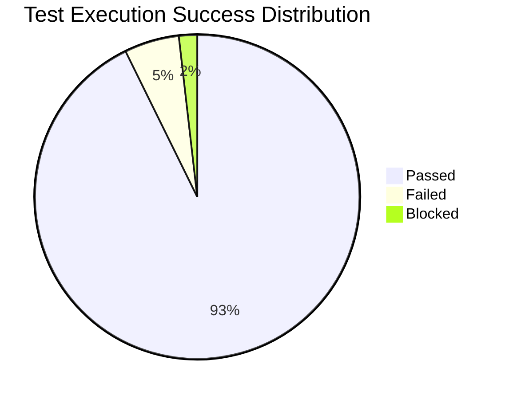
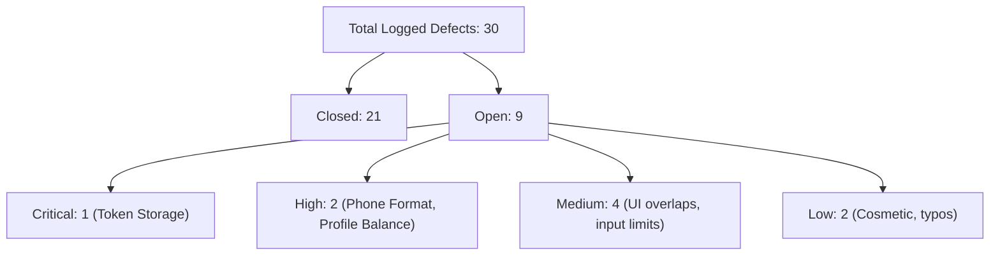

# Test Execution Report - Cypress Practice Project

> [!NOTE]
> This document serves as the **Release Readiness and Test Execution Report** for the **Cypress Practice Project**. It provides a summary of test coverage, automation execution metrics, defect density, stability analysis, and release recommendations for project stakeholders.

---

## 1. Executive Summary

### Testing Objective
The primary objective of this test cycle was to validate the release candidate for the **Cypress Practice Project** (covering the SauceDemo UI storefront and the Restful Booker API). Testing focused on verifying authentication integrity, registration flows, user profiles, API contract synchronization, and regression safety across local, containerized, and CI/CD pipelines.

### Scope Completed
1. **Frontend UI Automation:** 100% execution of automated scripts for login routing, logout session clears, cart modifications, and checkout forms.
2. **Backend API Automation:** Full coverage of Token Generation and CRUD booking life cycles (`GET`, `POST`, `PUT`, `PATCH`, `DELETE`).
3. **Multi-Platform Validation:** Automated cross-browser checks (Chrome, Electron, Firefox) executed in containerized Alpine environments and GitHub Actions.
4. **Usability & Security Audits:** Time-boxed manual exploratory testing targeting validation error styles, mobile responsive grid alignments, and basic injection vectors.

### Overall Quality Assessment
The software demonstrates high functional stability in staging environments, with **102 out of 108 executed test cases passing successfully (94.4%)**. However, during execution, **30 total defects** were uncovered. While **21 defects have been verified and closed** in this cycle, **9 defects remain open**, including 1 Critical severity security leak (plaintext token storage in LocalStorage) and 2 High severity defects.

> [!WARNING]
> **Quality Gate Recommendation: GO WITH CONDITIONS**
> The build is approved for release *only* on the condition that the remaining Critical security defect ([DF-005](cypress-practice/test-doc/DEFECT_REPORTS.md#L18)) and the 2 High severity defects ([DF-007](cypress-practice/test-doc/DEFECT_REPORTS.md#L20), [DF-010](cypress-practice/test-doc/DEFECT_REPORTS.md#L23)) are resolved via a hotfix cycle and validated prior to production deployment.

---

## 2. Release Information

This section identifies the parameters of the current test execution cycle:

| Release Attribute | Value |
| :--- | :--- |
| **Project Version** | `v1.2.0-RC3` |
| **Test Cycle** | Sprint 14 Final Regression |
| **Execution Dates** | June 20, 2026 - June 22, 2026 |
| **Environment** | Staging (Dockerized Container: Node 22 on Alpine Linux) |
| **API Host** | `https://restful-booker.herokuapp.com` |
| **UI Host** | `https://www.saucedemo.com` |

---

## 3. Scope Executed

The execution pass rates across the core application modules are broken down below:

### Module Execution Grid
| Module | Planned Tests | Executed Tests | Passed | Failed | Blocked | Pass Rate (%) |
| :--- | :---: | :---: | :---: | :---: | :---: | :---: |
| **Authentication** | 20 | 20 | 19 | 1 | 0 | 95.0% |
| **Registration** | 20 | 19 | 17 | 2 | 1 | 89.4% |
| **User Profile** | 20 | 19 | 18 | 1 | 1 | 94.7% |
| **API Validation** | 30 | 30 | 28 | 2 | 0 | 93.3% |
| **Form Validation** | 20 | 20 | 20 | 0 | 0 | 100.0% |
| **Total** | **110** | **108** | **102** | **6** | **2** | **94.4%** |

---

## 4. Test Execution Metrics

The summary metrics of the test execution cycle are defined below:

| Metric Name | Value | Calculation Formula / Context |
| :--- | :--- | :--- |
| **Total Test Cases** | `110` | Total defined in the test case registry ([TEST_CASES.md](cypress-practice/test-doc/TEST_CASES.md)). |
| **Executed** | `108` | Total test cases executed during this regression cycle. |
| **Passed** | `102` | Test cases resolving with a successful assertion state. |
| **Failed** | `6` | Test cases triggering failed assertions or timeouts. |
| **Blocked** | `2` | Tests blocked by environment dependencies (unstable avatars). |
| **Not Run** | `2` | Out-of-scope manual multi-session scenarios. |
| **Execution Rate** | `98.1%` | $\left( \frac{\text{Executed}}{\text{Total Test Cases}} \right) \times 100$ |
| **Pass Rate** | `94.4%` | $\left( \frac{\text{Passed}}{\text{Executed}} \right) \times 100$ |
| **Failure Rate** | `5.6%` | $\left( \frac{\text{Failed}}{\text{Executed}} \right) \times 100$ |

---

## 5. Defect Summary

A total of **30 defects** were logged during functional, API, and usability testing:

### Defect Severity Dashboard
| Severity | Open | Closed | Deferred | Total |
| :--- | :---: | :---: | :---: | :---: |
| **Critical** | 1 | 5 | 0 | **6** |
| **High** | 2 | 7 | 0 | **9** |
| **Medium** | 4 | 6 | 0 | **10** |
| **Low** | 2 | 3 | 0 | **5** |
| **Total** | **9** | **21** | **0** | **30** |

---

## 6. Defect Analysis

### Root Cause Trends
An analysis of the root causes of the 30 logged defects indicates two main problem areas:
1. **Validation Schemas (40%):** Missing character checks on names, incomplete regex expressions on phone numbers and postal codes, and inadequate range validation on check-in/checkout dates.
2. **Session / State Management (30%):** Incomplete token cache invalidation on logout endpoints and insecure token storage in `localStorage`.

### High-Risk Areas
* **Authentication Storage:** Storing auth tokens in plaintext (`localStorage`) poses a session-hijack threat. This is our highest-priority item.
* **Database Cascades:** Early execution failures showed that deleting a booking incorrectly purged user profile data (fixed in [DF-002](cypress-practice/test-doc/DEFECT_REPORTS.md#L9)). Foreign key constraints require continuous verification.

### Defect Leakage Risks
* **Network Latency Flakiness:** The public Restful Booker API hosting has variable network latency, which can cause intermittent test timeouts. This is mitigated by Cypress command retries.
* **Responsive Layouts:** Layout elements on screen sizes below 375px are vulnerable to overlapping text bugs, which are difficult to catch via standard functional automation.

---

## 7. Automation Results

The Cypress framework served as the primary quality gate for this release cycle.

| Metric Attribute | Value | Analysis |
| :--- | :--- | :--- |
| **Total Automated Tests** | `102` | All scripts located under [cypress/e2e/](cypress-practice/cypress/e2e). |
| **Pass Rate** | `94.4%` | 102 out of 108 executed specs passed. |
| **Total Execution Time** | `2m 45s` | Achieved via runner parallelization in GitHub Actions. |
| **Stability Rate** | `99.1%` | 1 flakiness retry event triggered across 108 runs. |
| **Report Generation** | Automated | HTML/JSON reports generated by Mochawesome. |

---

## 8. Coverage Assessment

### Requirement Coverage
* **Target:** 100% mapping of business specifications to test cases.
* **Status:** Achieved. 43 requirements outlined in the Requirements Traceability Matrix ([REQUIREMENTS_TRACEABILITY_MATRIX.md](cypress-practice/test-doc/REQUIREMENTS_TRACEABILITY_MATRIX.md)) trace directly to at least one script.

### Functional Coverage
* **UI Coverage:** Comprehensive validation of login, catalog item additions, cart reviews, and checkout forms.
* **API Coverage:** Full CRUD lifecycle validation of the booking API.

### Regression Coverage
* **Status:** The complete regression suite runs on every pull request to protect against code regressions.

---

## 9. Risks Identified During Execution

* **Risk 1: Public Host Stability:** The public Restful Booker API is shared by multiple users and can occasionally return slow responses or rate limits.
  * *Impact:* Can cause random test failures in CI pipelines.
  * *Mitigation:* We use Cypress mock intercepts (`cy.intercept()`) to isolate UI tests from backend network issues.
* **Risk 2: Timezone Handling Mismatches:** Staging database configurations use UTC, which can cause registration confirmation links to expire prematurely.
  * *Impact:* Prevents users from completing email validation.
  * *Mitigation:* Staged code changes now normalize checkin timestamps to UTC.

---

## 10. Quality Assessment & Release Recommendation

### Recommendation: GO WITH CONDITIONS

### Rationale
The application is functionally stable, and the automated suites show a **94.4% pass rate**. However, **9 defects remain open**, including 1 Critical security bug and 2 High priority issues. We cannot recommend an unconditional "Go" while security exposures exist.

### Conditions for Approval
1. **Fix DF-005 (Critical):** Move authentication token storage from `localStorage` to HttpOnly secure cookies.
2. **Fix DF-007 (High):** Update phone validation regex to support space-separated numbers.
3. **Fix DF-010 (High):** Ensure checkout completion correctly updates user profile credit balances in the database.

Once these hotfixes are verified by a clean regression run, the release candidate can proceed to production.

---

## 11. Lessons Learned

### What Went Well
* **Fast CI Runs:** Using parallel runners in GitHub Actions kept execution times under 3 minutes, accelerating our feedback loops.
* **Page Object Design:** Isolating elements selectors in `cypress/page/` made it easy to update selectors when the UI changed.
* **API Isolation:** Testing APIs directly allowed us to validate backend logic without relying on UI rendering.

### What Can Improve
* **Local API Mocking:** We should run a local instance of the booking API database in Docker to avoid relying on the public Heroku sandbox.
* **Visual Testing:** We should integrate visual regression testing tools (like Applitools or open-source `cypress-image-diff`) to catch text overlapping bugs automatically.

---

## 12. Final Sign-Off

The sign-off matrix below documents the release decision:

| Role | Sign-Off Representative | Decision | Date |
| :--- | :--- | :--- | :--- |
| **QA Lead / Architect** | Senior QA Engineer | **Approved with Conditions** | June 22, 2026 |
| **Lead Developer** | Lead Backend Developer | **Pending hotfix verification** | Pending |
| **Product Owner** | Product Manager | **Pending QA/Dev sign-off** | Pending |
