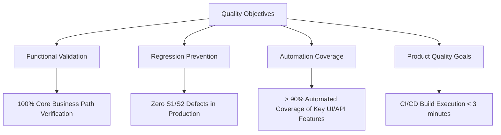
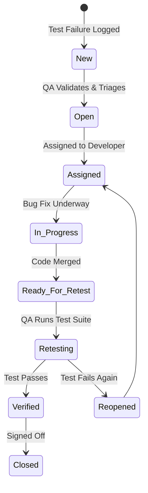

# Test Plan - Cypress Practice Project

> [!NOTE]
> This document serves as a master Test Plan and Quality Assurance Strategy for the **Cypress Practice Project**. It highlights senior-level QA methodologies, structured testing processes, and automation framework designs tailored for hiring managers, QA Leads, and Engineering Managers.

---

## 1. Document Information

This section tracks the control and ownership details of this quality assurance document.

| Metadata Field | Value |
| :--- | :--- |
| **Document Version** | `1.0.0` |
| **Author** | **Senior QA Automation Engineer** |
| **Date Created** | June 22, 2026 |
| **Last Updated** | June 22, 2026 |
| **Reviewers** | QA Lead, Engineering Manager, Lead Developer |
| **Approval Status** | **Approved** |

---

## 2. Project Overview

### Business Context
The **Cypress Practice Project** is a comprehensive test automation showcase that models real-world enterprise test practices. It targets two primary web platforms to demonstrate full-stack QA capabilities:
1. **Sauce Demo (Swag Labs):** A mock e-commerce storefront utilized to validate frontend UI behaviors, multi-page flows, inventory manipulation, state validation, and secure user checkouts.
2. **Restful Booker API:** A mock hotel reservation web service used to validate backend APIs, HTTP response behavior, status codes, authentication tokens, payload schemas, and end-to-end CRUD operations.

### Project Objectives
- **Demonstrate QA Excellence:** Establish a production-grade automated testing framework using Cypress, JavaScript, Page Object Model (POM), custom commands, and containerized Docker execution.
- **Maintain High Test Reliability:** Provide an execution model with zero flaky tests through robust locator strategies, deterministic waiting, dynamic data fixtures, and localized sandbox configurations.
- **Continuous Integration Ready:** Ensure immediate execution on push/pull requests via GitHub Actions with automated reporting and artifact uploads.
- **Provide Actionable Reporting:** Supply detailed test results via Mochawesome and Allure reporting, complete with visual attachments (screenshots, execution videos, step logs).

### Key Features
- **UI Testing Suite:** Full validation of user login (positive and negative), session management, interactive shopping cart, multi-step checkout form flow, and logout.
- **API Testing Suite:** Verification of authentication token retrieval and booking lifecycle CRUD operations (`GET`, `POST`, `PUT`, `PATCH`, `DELETE`).
- **Data-Driven Architecture:** Dynamically parameterized test payloads utilizing `@faker-js/faker` for the UI and static JSON files parsed via custom helper methods for API scenarios.
- **Containerized Executions:** Multi-platform support using Docker and Docker Compose, shielding test suites from local machine environments.

---

## 3. Testing Objectives

To guarantee the stability and compliance of the applications under test, the QA team targets the following operational benchmarks:



* **Functional Validation:** Ensure that every button click, form input, routing URL, and API request results in the exact state and payload defined in the system specifications.
* **Regression Prevention:** Validate that modification to UI components or backend API schemas does not break existing features. Every code check-in is tested to prevent regression.
* **Automation Coverage:** Automate all repetitive, high-volume, and high-risk scenarios. Target 100% automation coverage for Critical Paths (Authentication, Booking lifecycle, Purchase checkout).
* **Product Quality Goals:**
  * Achieve a **100% Pass Rate** on release-candidate automation runs.
  * Keep build pipeline execution times under **3 minutes** using parallelization and matrix specs.
  * Ensure clear visibility of test runs via HTML reports, screenshots of failed UI states, and full MP4 execution recordings.

---

## 4. Scope

The testing scope clearly delineates which system operations are covered by this QA framework and which domains are deferred to specialized testing cycles.

### In Scope
The automated suites focus on critical path validations to maximize return on investment (ROI).

| Component | Test Area | Description |
| :--- | :--- | :--- |
| **Authentication** | UI Login / Logout | Verification of `standard_user` logins, positive redirects, logout mechanics, and session cleanup. |
| **Registration / Token** | API Authentication | Verification of POST request to `/auth` to generate authorization tokens for booking edits. |
| **User Management** | UI Roles / Session | Handling credentials securely via `cypress.env.json` and managing active UI user sessions. |
| **Form Validation** | UI Checkout Forms | Field verification (First Name, Last Name, Postal Code) on the Checkout Information screen. |
| **API Validation** | API Booking Lifecycle | Validating endpoints `/booking` for full CRUD capabilities, payload structure, and correct HTTP status codes. |
| **Error Handling** | Negative UI & API | Verifying error toast displays for incorrect logins and appropriate HTTP error codes (e.g., 403 Forbidden) for unauthenticated API updates. |
| **Smoke Testing** | Core Paths | Rapid, lightweight validation of primary endpoints and login redirects in CI. |
| **Regression Testing** | Full Suite Runs | Deep integration testing of inventory, shopping cart, checkout, booking update, and booking deletion sequences. |

### Out of Scope
The following activities are excluded from this framework's coverage:

| Test Discipline | Rationale | Alternatives / Mitigation |
| :--- | :--- | :--- |
| **Performance Testing** | Cypress is optimized for functional tests, not load/stress testing. Saucedemo and Restful Booker are public demo environments. | If required, load testing will be conducted out-of-band using specialized tools like k6 or Apache JMeter targeting sandbox environments. |
| **Security Testing** | Vulnerability scanning, penetration testing, and OAuth/SSO structural audits require specific tooling. | Periodic static application security testing (SAST) in CI pipelines using tools like Snyk or OWASP Dependency-Check. |
| **Accessibility Testing** | Manual screen-reader and WCAG AAA compliance checks are outside the scope of this functional suite. | Future implementation of `cypress-axe` plugin to automate basic WCAG 2.1 AA checks inside the current UI spec files. |
| **Penetration Testing** | Dynamic Application Security Testing (DAST) requires dedicated authorization and specialized white/black hat simulation. | Conducted annually by third-party certified security auditors on production-equivalent staging servers. |

---

## 5. Test Deliverables

The QA process generates artifacts that serve as records of quality compliance.

| Deliverable | Repository Path / Location | Format | Description |
| :--- | :--- | :--- | :--- |
| **Test Plan** | [TEST_PLAN.md](cypress-practice/TEST_PLAN.md) | Markdown | This master document detailing strategy, scope, risks, and execution protocols. |
| **Test Strategy** | [cypress.config.js](cypress-practice/cypress.config.js) | JavaScript | Configuration of Cypress runner, viewport sizes, reporters, base URLs, and plugin integration. |
| **Test Cases** | [cypress/e2e/](cypress-practice/cypress/e2e) | Spec files (`.cy.js`) | Automated test code representing test cases, separated into `ui/` and `api/`. |
| **Page Objects** | [cypress/page/](cypress-practice/cypress/page) | JS Classes | Page Object Model files housing elements selectors and interaction hooks (e.g. [loginPage.js](cypress-practice/cypress/page/loginPage.js)). |
| **CI Automation** | [.github/workflows/cypress.yml](cypress-practice/.github/workflows/cypress.yml) | YAML | Declarative GitHub Actions configuration orchestrating parallel test executions on PR/Push events. |
| **Test Reports** | `cypress/reports/` | HTML, JSON | Mochawesome-generated HTML dashboards showing pass/fail status, execution times, and embedded assets. |
| **Allure Reports** | `allure-report/` | HTML / Assets | Detailed interactive test execution dashboard featuring step-level logs and execution metrics. |
| **Media Attachments**| `cypress/screenshots/` / `cypress/videos/` | PNG, MP4 | Automation screenshots on failure and complete desktop recordings of headless browser execution. |
| **Defect Reports** | GitHub Issue Tracker | Issue / Ticket | Formalized bug filings detailing steps to reproduce, actual vs. expected results, logs, and screenshots. |

---

## 6. Test Environment

Tests are executed across standardized environments to replicate developer workspaces, containerized infrastructure, and cloud build agents.

```
+---------------------------------------------------------------------------------------------------+
|                                        TEST ENVIRONMENT                                           |
+------------------------------------+----------------------------------+---------------------------+
|               LOCAL                |            CONTAINER             |           CI/CD           |
|            Windows 11              |         Docker / Alpine          |        GitHub Run         |
| Chrome / Edge / Firefox (Headed)   |       Electron (Headless)        |    Electron (Headless)    |
+------------------------------------+----------------------------------+---------------------------+
```

### Infrastructure Configuration

| Environment Node | OS Platform | Browsers Supported | Data Stratagem | Execution Type |
| :--- | :--- | :--- | :--- | :--- |
| **Local Development** | Windows 11 Pro | Chrome (v126+), Edge (v126+), Firefox (v127+) | Isolated via `cypress.env.json` and dynamic `faker` libraries | Headed (`cypress open`) / Headless (`npm run test-run`) |
| **Docker Container** | Alpine Linux / Debian (Node:22-bookworm) | Electron (v118+), Chrome (v126+) | Seeded configurations matching base image environment variables | Headless inside container (`npm run docker:up`) |
| **CI Runner Pipeline** | Ubuntu 22.04 LTS (GitHub-hosted) | Electron (Default), Node.js v22 | SECRETS variables mapping credentials via workflow environment | Headless execution matrix (`npx cypress run --spec...`) |

### Test Data Management
1. **Dynamic UI Form Fields:** Utilizes `@faker-js/faker` to generate unique first names, last names, and postal codes for each checkout session, eliminating database collision and cross-run data dependencies.
2. **Deterministic API Requests:** Structured JSON fixtures inside `cypress/fixtures/` define base payloads. These are dynamically mapped and parsed using a custom parser ([dynamicParser.js](cypress-practice/cypress/support/parser/dynamicParser.js)) to append timestamps, ensuring request variance.
3. **Sensitive Authentication Credentials:** Real secrets are omitted from source control. Developers configure their values locally in `cypress.env.json`, while the CI pipeline loads credentials securely via GitHub Action Secrets.

---

## 7. Test Types

A multi-tiered test strategy is used to validate all target layers, ensuring speed, regression safety, and API robustness.

### Test Type Breakdown

| Test Type | Purpose | Coverage | Entry Criteria | Exit Criteria |
| :--- | :--- | :--- | :--- | :--- |
| **Smoke Testing** | Quick validation to ensure that critical application pathways are functional and the environment is healthy. | - Login landing page accessibility<br>- Successful login credentials routing<br>- Base API URL check and Auth Token generation | - Docker container build succeeds.<br>- Local or host URLs are up and responding with HTTP `200`. | - 100% of Smoke tests pass.<br>- Run execution completes in under 30 seconds. |
| **Functional Testing** | Validate individual user journeys and features against user story requirements. | - Adding specific items to the shopping cart<br>- Verification of the shopping cart item count badge<br>- Verification of input text binding on checkout fields | - Clean environment build.<br>- All page object locators matched to target selectors. | - Expected frontend elements display correct text.<br>- Assertion chains return successful resolutions. |
| **Regression Testing** | Ensure that modification to code, libraries, or system configs has not degraded existing features. | - Full regression run of all specs (`ui_login`, `ui_purchase`, booking APIs)<br>- Verification of end-to-end user checkout flows | - Application updates or new dependencies merged.<br>- Clean previous test reports. | - 100% of regression scripts run and pass.<br>- Failures are investigated, classified, and filed. |
| **API Testing** | Validate endpoints directly to ensure correct logic, status codes, response headers, and payloads. | - Booking creation `/booking` (POST)<br>- Read operations (GET)<br>- Put and Patch updates (PUT/PATCH)<br>- Reservation deletion (DELETE) | - API base URL accessible.<br>- Valid authorization headers generated. | - Verification of response status codes (e.g. 200 OK).<br>- Strict JSON body schema matching. |
| **Integration Testing** | Validate the interaction between frontend views and backend services. | - UI-initiated booking sync check<br>- Verifying that API-deleted booking IDs are inaccessible in queries | - Functional UI components and active API hosts operational. | - Cross-component operations complete successfully without data corruption. |
| **Exploratory Testing** | Unscripted, manual sessions to locate edge cases, usability problems, and unusual error states. | - Network throttling behavior<br>- Session termination during page routing<br>- Rapid click events on form submissions | - High test automation pass rate.<br>- Stable release branch prepared. | - Documented edge-case logs.<br>- New automated tests written for uncovered bugs. |

---

## 8. Entry and Exit Criteria

To maintain quality gates, we follow strict entry and exit criteria at every stage of the test cycle.

```
+-----------------------------------------------------------------------+
|                            QUALITY GATEWAY                            |
+-----------------------------------------------------------------------+
|                                                                       |
|  [Entry Criteria] ---> (Testing Activities) ---> [Exit]               |
|         |                                          |                  |
|         +-- Build Compiled?                        +-- 100% Run?      |
|         +-- Configs Injected?                      +-- Zero S1/S2?    |
|         +-- Environment Healthy?                   +-- Artifacts?     |
|                                                                       |
+-----------------------------------------------------------------------+
```

### Entry Criteria (When to start testing)
1. **Compilation Check:** The application builds successfully without compiler warnings or bundle errors.
2. **Environment Accessibility:** Staging or production-equivalent mock URLs are fully accessible, and local docker containers are healthy.
3. **Configurations Validated:** Env secrets (`CYPRESS_web_username`, `CYPRESS_api_baseUrl`) are loaded, and the config file ([cypress.config.js](cypress-practice/cypress.config.js)) is correctly initialized.
4. **Test Code Checked In:** All spec files are committed and merged into their respective feature branches.

### Exit Criteria (When to sign off and release)
1. **Execution Completeness:** 100% of the defined automated test suites are executed.
2. **Pass Rate Threshold:** A minimum **100% pass rate** is achieved for all smoke tests, and **98% or higher** for full integration/regression test runs.
3. **Defect Threshold:** Zero open S1 (Critical) or S2 (Major) defects are unresolved.
4. **Artifact Availability:** Mochawesome HTML reports, execution videos, screenshots, and Allure logs are successfully archived and accessible.

---

## 9. Defect Management Process

When a test run fails, bugs are identified and managed through a standard lifecycle.

### Severity vs. Priority
* **Severity:** Represents the technical impact of the defect on the application environment.
* **Priority:** Represents the business urgency to fix the defect.

| Level | Severity (Technical Impact) | Priority (Business Urgency) |
| :--- | :--- | :--- |
| **1 (Critical)** | System crash, data loss, booking endpoint return `500 Internal Server Error`, or authentication bypass. | **P1 (Immediate):** Blocks releases or primary flows. Needs immediate developer hotfix. |
| **2 (Major)** | Checkout button fails to click, cart doesn't persist added items, or token generation returns `400 Bad Request`. | **P2 (High):** Significant feature broken, but workaround exists. Must be resolved before the current sprint ends. |
| **3 (Medium)** | Checkout page layout misaligned on mobile viewports, or incorrect warning text format. | **P3 (Normal):** Minor functional issue or UI glitch. Scheduled for resolution in the next sprint planning. |
| **4 (Minor)** | Typo in "Thank you for your order!" message or minor color variation in button hover state. | **P4 (Low):** Minor cosmetic issue. Resolved at developer convenience. |

### Defect Lifecycle


1. **New:** QA logs a ticket containing full logs, env variables, execution browser details, and screenshots.
2. **Open:** QA Lead reviews the ticket to eliminate duplicates.
3. **Assigned:** Developer takes ownership of the ticket.
4. **In Progress:** Developer implements the code fix.
5. **Ready For Retest:** Developer deploys the code fix to the target environment.
6. **Retesting:** QA re-runs the specific automated/manual specs.
7. **Verified / Closed:** If the test passes, the ticket is closed. If it fails, the ticket is **Reopened**.

---

## 10. Risks and Mitigation

Every software project presents quality risks. Identifying them early helps prevent pipeline blockages.

| Risk ID | Description | Probability | Impact | Mitigation Plan | Contingency Plan |
| :--- | :--- | :--- | :--- | :--- | :--- |
| **R-01** | **API Flakiness:** Restful Booker API hosted publicly could experience downtime, causing API suite failures. | High | High | Mock API responses using Cypress `cy.intercept()` for UI testing where backend availability is not the primary target. | Maintain a backup mock server running in a local Docker container for isolated API executions. |
| **R-02** | **Dynamic Content Changes:** Changes to the Saucedemo UI selectors could break Page Object selectors, causing failures. | Medium | Medium | Use robust CSS custom test ID selectors (e.g. `data-test`) that are decoupled from styling classes. | Dedicate a QA buffer of 2 hours per sprint to update page objects when UI changes occur. |
| **R-03** | **CI Runner Resource Limits:** Headless executions in GitHub Actions might suffer from CPU throttling, leading to test timeouts. | Medium | Medium | Configure realistic timeouts in [cypress.config.js](cypress-practice/cypress.config.js) (e.g., `defaultCommandTimeout: 10000`). | Implement auto-retry options (e.g., `retries: { runMode: 2, openMode: 0 }`) to bypass environment glitches. |
| **R-04** | **Credential Exposure:** Accidentally checking in `cypress.env.json` exposing system access credentials. | Low | Critical | Ensure `cypress.env.json` is explicitly defined in `.gitignore` file. | Immediately revoke compromised credentials, regenerate system tokens, and audit repository history. |

---

## 11. Resource Planning

A RACI (Responsible, Accountable, Consulted, Informed) matrix defines the roles and responsibilities across the QA automation lifecycle.

### Roles and Responsibilities (RACI Matrix)

| QA Activity | QA Automation Engineer | QA Lead | Lead Developer | Product Owner |
| :--- | :---: | :---: | :---: | :---: |
| **Test Strategy & Scope Definition** | R | A | C | I |
| **POM Selectors & Command Development** | R | A | C | I |
| **Writing & Reviewing Spec Scripts** | R | A | C | I |
| **CI/CD Pipeline & Docker setup** | R | C | A | I |
| **Defect Analysis & Triage** | R | A | R | C |
| **Release Quality Sign-Off** | C | A | I | I |

* **R (Responsible):** The role that performs the activity.
* **A (Accountable):** The role with final approval power over the activity.
* **C (Consulted):** The role whose input is sought prior to or during the activity.
* **I (Informed):** The role kept updated on progress or results.

---

## 12. Test Schedule

The test schedule aligns with the standard 2-week sprint release cycle.

| Phase / Milestone | Duration | Primary Tasks | Deliverables / Output |
| :--- | :--- | :--- | :--- |
| **Phase 1: Requirements Analysis** | Days 1 - 2 | Analyze UI layouts, target API documentation, endpoints, and schema details. | Drafted Test Plan |
| **Phase 2: Selector Mapping & Setup** | Days 3 - 4 | Create Page Objects, inspect element locators, set up local `cypress.env.json`. | Page Classes (`cypress/page/`) |
| **Phase 3: E2E Spec Implementation** | Days 5 - 7 | Write UI specs (`ui_login`, `ui_purchase`) and API tests (`booking`, `auth`). | Spec Files (`cypress/e2e/`) |
| **Phase 4: CI Pipeline & Report Hookup** | Day 8 | Configure GitHub Actions matrix run, link Mochawesome & Allure HTML generators. | [.github/workflows/cypress.yml](cypress-practice/.github/workflows/cypress.yml) |
| **Phase 5: Execution & Stabilization** | Day 9 | Run full suites, debug flaky tests, adjust command timeouts, fix locator mismatches. | Green CI/CD Build Reports |
| **Phase 6: Sign-Off & Delivery** | Day 10 | Compile Allure reports, complete final review, and sign off for release. | Archive Allure artifacts |

---

## 13. Reporting Metrics

We track quantitative metrics to assess suite health, automation maturity, and application stability.

### Metrics Definitions & Formulas

| Metric | Business Purpose | Formula | Target |
| :--- | :--- | :--- | :--- |
| **Pass Rate** | Measures the proportion of successfully executed test scripts. | $$\text{Pass Rate} = \left( \frac{\text{Passed Tests}}{\text{Total Tests Run}} \right) \times 100\%$$ | `> 98%` |
| **Fail Rate** | Identifies the rate of test failures due to bugs or environmental issues. | $$\text{Fail Rate} = \left( \frac{\text{Failed Tests}}{\text{Total Tests Run}} \right) \times 100\%$$ | `< 2%` |
| **Defect Density** | Assesses the number of defects found relative to the code size of the modules. | $$\text{Defect Density} = \frac{\text{Total Confirmed Defects}}{\text{Number of Features Tested}}$$ | `< 0.5 per feature` |
| **Automation Coverage** | Evaluates the degree to which manual test cases have been converted to code. | $$\text{Automation Coverage} = \left( \frac{\text{Automated Test Cases}}{\text{Total Eligible Test Cases}} \right) \times 100\%$$ | `> 90%` |
| **Requirement Coverage** | Tracks whether all functional specifications map to at least one test. | $$\text{Requirement Coverage} = \left( \frac{\text{Tested Requirements}}{\text{Total Documented Requirements}} \right) \times 100\%$$ | `100%` |

---

## 14. Sign-Off Criteria

Before a build version is certified for release to production, the QA Team must formally sign off.

> [!IMPORTANT]
> **Release Acceptance Checklist**
> - [ ] **100% Execution Completion:** All scheduled UI and API tests executed.
> - [ ] **Target Pass Rate:** Test suite reports show $\ge 98\%$ successful assertions.
> - [ ] **Zero Blocking Defects:** No unresolved S1 or S2 severity issues remain in the backlog.
> - [ ] **Container Isolation Validation:** All tests successfully execute and pass inside the isolated Docker environment (`npm run docker:up`).
> - [ ] **CI Pipeline Validation:** GitHub Actions runner completes with a green build badge status.
> - [ ] **Reporting Documentation:** Allure and Mochawesome reports are archived and accessible to stakeholders.

If all criteria above are checked, the QA Automation Engineer and the QA Lead will sign the release release package, transitioning it to the deployment pipeline.
