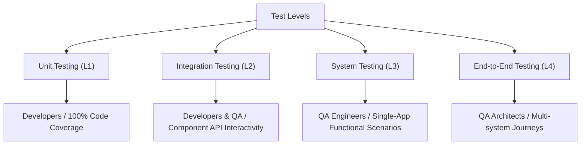
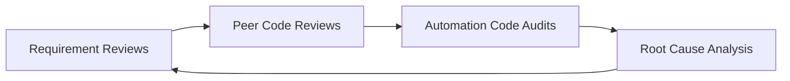

# Test Strategy - Cypress Practice Project

> [!NOTE]
> This document defines the comprehensive Test Strategy and Quality Engineering blueprint for the **Cypress Practice Project**. It outlines the QA methodology, architectural layers, environment strategy, test data management, and continuous quality integration gates necessary to assure the release quality of the software system.

---

## 1. Strategy Overview

### Testing Philosophy
Our testing philosophy is built on **Automation-First** and **Shift-Left** principles. We treat test automation code with the same rigor, clean-code practices, and reviews as production application code. We aim to:
1. Establish a rapid feedback loop for engineers.
2. Maintain high stability through page objects and deterministic wait strategies.
3. Validate backend business logic directly via APIs before inspecting UI components.

### Quality Goals
* **Reliability:** Execute automated suites with zero intermittent or flaky failures.
* **Speed:** Complete the entire parallel regression execution sequence in less than 3 minutes inside CI.
* **Visibility:** Provide clear reports with logs, screenshots, and videos embedded for any execution failure.

### Risk-Based Testing Approach
Not all components carry the same business weight. We identify and score system areas using a risk matrix (Impact $\times$ Probability) to align testing depth with application criticality. Testing efforts are scaled dynamically: high-risk elements receive deep integration coverage, whereas lower-risk features rely on basic automated smoke validations or exploratory checks.

---

## 2. Quality Objectives

The QA division monitors and certifies quality using five core measurable Key Performance Indicators (KPIs):

| KPI Metric | Measurement Context | Target threshold | QA Validation Method |
| :--- | :--- | :--- | :--- |
| **Critical Path Pass Rate** | Core workflows: user login, item checkout, token creation, booking lifecycle. | `100%` | Fully automated execution check in CI blockages. |
| **Regression Confidence** | Assurance that existing features do not break following new branch merges. | `> 99%` | Comprehensive suite run comparing current execution state against master branch benchmark. |
| **Automation Coverage** | Percentage of eligible functional test cases that are executed by automation scripts. | `> 90%` | Requirement traceability matrix check in the planning tool. |
| **Flakiness Index** | The percentage of automated tests that fail and then pass on retries due to non-product errors. | `< 1%` | CI failure audit logs tracking flakiness rate across builds. |
| **Defect Detection Rate** | The percentage of defects found by automated pipelines before releasing to production. | `> 95%` | Post-release defect tracking: $\frac{\text{QA Defects Found}}{\text{Total Defects Found}} \times 100$. |

---

## 3. Test Levels

We apply testing across four distinct levels to guarantee thorough system verification:



### Unit Testing
* **Purpose:** Validates individual methods, isolated functions, component rendering, utilities, and parsers.
* **Ownership:** Software Development Engineers (SDEs).
* **Coverage:** 100% of custom functions, state selectors, and utility methods (e.g., [dynamicParser.js](cypress-practice/cypress/support/parser/dynamicParser.js)).

### Integration Testing
* **Purpose:** Assures the data contract compliance and interface synchronization between components (e.g., UI connecting to booking APIs, or auth services passing tokens to databases).
* **Ownership:** SDEs and QA Engineers.
* **Coverage:** Contract validations, network request payloads, response schema structure, and mock service virtualization.

### System Testing
* **Purpose:** Focuses on complete subsystem behavior (e.g., checking that the full checkout sequence updates backend cart state databases).
* **Ownership:** QA Automation Engineers.
* **Coverage:** User interface flow, API end-to-end integration specs, and containerized Docker setup.

### End-to-End Testing
* **Purpose:** Exercises the full customer journey from landing pages to transaction completion across multiple platforms.
* **Ownership:** QA Automation Lead / Architect.
* **Coverage:** Multi-page UI checkout journeys (e.g., [ui_purchase.cy.js](cypress-practice/cypress/e2e/ui/ui_purchase.cy.js)) and complete Booking REST API lifecycle runs.

---

## 4. Test Approach

Our strategy shifts QA from an after-the-fact validation phase to an active engineering process.

```
                  SHIFT-LEFT TESTING PIPELINE
  
  [Requirements] ----> [Design] ----> [Coding] ----> [CI/CD Run]
        |                |               |               |
     QA Review      Test Cases      Unit Tests       Regression
     & Critique      Drafted        Prototyped        Triggered
```

* **Risk-Based Testing:** Automated suite executions are parameterized. Under tight release windows, we execute only high-priority scripts as a smoke sub-suite to speed up delivery.
* **Exploratory Testing:** We execute structured, time-boxed exploratory charters on release candidates to identify edge cases, performance UI stutters, and visual rendering bugs.
* **Automation-First Strategy:** Functional specifications are translated directly into automated Cypress specifications. Manual testing is reserved for initial exploratory discovery and UI layout review.
* **Shift-Left Testing:** QA interacts with product managers during draft requirements to identify design gaps early, preventing code defects before developers write their first line of code.

---

## 5. Automation Strategy

### Framework Design
The automation framework is built on **Cypress (JavaScript)** utilizing a modular design:

```
                            CYPRESS ARCHITECTURE
  
              +-----------------------------------------------+
              |            Reporter (Allure/Mochawesome)      |
              +-----------------------+-----------------------+
                                      |
              +-----------------------v-----------------------+
              |                  Test Specs                   |
              |     cypress/e2e/ui/*     cypress/e2e/api/*    |
              +-----------------------+-----------------------+
                                      |
              +-----------------------v-----------------------+
              |           Page Objects & Custom Commands      |
              |       cypress/page/*     cypress/support/*    |
              +-----------------------+-----------------------+
                                      |
              +-----------------------v-----------------------+
              |                Dynamic Fixtures & Parsers     |
              |           faker-js       dynamicParser.js     |
              +-----------------------------------------------+
```

1. **Page Object Model (POM):** Element selectors and interaction helper functions are isolated within dedicated classes under `cypress/page/` (e.g. [loginPage.js](cypress-practice/cypress/page/loginPage.js)).
2. **Custom Commands:** Reusable global interactions (like `cy.login()` or `cy.logout()`) are centralized in [commands.js](cypress-practice/cypress/support/commands.js).
3. **Data Decoupling:** Static templates in JSON are stored in `cypress/fixtures/` and mapped using dynamic data generators to avoid hardcoding values.

### Test Layering
The suite is layered across different levels to optimize execution speed:
* **UI Test Layer:** Validates DOM manipulation, client-side validation, error banners, and page redirects (e.g. [ui_login.cy.js](cypress-practice/cypress/e2e/ui/ui_login.cy.js)).
* **API Test Layer:** Direct REST assertions evaluating payload contract integrity, headers, and performance latency.
* **Integration Layer:** Mixed-mode scenarios that prepare test states via API requests (`POST /booking`) and verify updates directly on the user interface.

### Why API Tests are Preferred
Where functional logic does not depend on UI rendering, we prioritize API-level verification. Testing APIs offers three key benefits:
1. **Speed:** API calls execute in milliseconds compared to seconds for browser renders.
2. **Stability:** API tests do not experience CSS locator changes, rendering delays, or animation blockers.
3. **Isolate Logic:** We can easily validate error statuses, authorization access rules, and field bounds without building complex frontend UI states.

---

## 6. Test Data Strategy

Ensuring clean, repeatable test runs requires strict control of the test data lifecycle.

| Data Strategy | Implementation Details | QA Benefit |
| :--- | :--- | :--- |
| **Static Data** | Stored in static JSON files under `cypress/fixtures/` defining base payload templates. | Provides a consistent baseline for input validation. |
| **Dynamic Data** | Generated at runtime using `@faker-js/faker` for user names, check-in dates, and details. | Prevents state duplication and database conflict issues. |
| **Data Isolation** | Each test session uses newly generated IDs or mock accounts, ensuring no test affects another. | Enables safe, concurrent test executions. |
| **Data Cleanup** | API test runs utilize hooks (`after()` block calling DELETE) to remove created records. | Keeps target database clean and maintains low overhead. |

---

## 7. Environment Strategy

Tests are run across multiple environments, each configured with specific variables loaded via `cypress.env.json` or CI system variables.

1. **Local Environment:** 
   * Targeted during feature development.
   * Run using `npm run test` (Cypress Runner UI) or `npm run test-run` (Headless).
   * Environment configuration: localhost API servers or sandboxed staging endpoints.
2. **QA / Sandbox:**
   * Automated tests trigger on pull request changes.
   * Containerized execution via Docker to guarantee identical environment dependencies.
3. **Staging:**
   * Replicates production styling, scaling, and database structures.
   * Full nightly regression suite execution to check for backend integration issues.
4. **Production Considerations:**
   * Only run read-only smoke checks (e.g. login landing page checks) to avoid generating dummy transactions or corrupting metrics.

---

## 8. Defect Prevention Strategy

Our QA strategy focuses on preventing bugs early in the lifecycle rather than discovering them right before release.



* **Requirement Reviews:** QA joins product refinement calls to review functional specification ambiguity before code writing begins.
* **Peer Reviews:** All product pull requests must be approved by QA to verify that development code aligns with the initial requirements.
* **Automation Reviews:** All test scripts undergo peer code reviews to ensure clean POM locators, assertion styles, and proper configuration in [cypress.config.js](cypress-practice/cypress.config.js).
* **Root Cause Analysis (RCA):** If a defect escapes to production, we conduct a blameless post-mortem analysis to identify why the test pipeline missed it, immediately creating a regression test case for that scenario.

---

## 9. Risk-Based Testing Model

We evaluate features using a structured matrix to identify high-risk areas and plan test coverage accordingly.

| Feature Area | Business Impact (1-5) | Defect Probability (1-5) | Risk Score (Impact x Prob) | Test Depth | Automation Level |
| :--- | :---: | :---: | :---: | :--- | :--- |
| **User Authentication** | 5 | 2 | **10** | High: Full positive and negative validation. | 100% Automated |
| **Checkout Flow & Purchases** | 5 | 3 | **15** | High: Multi-item additions, input validation. | 100% Automated |
| **Booking Creation API** | 4 | 3 | **12** | High: Schema validation, token verification. | 100% Automated |
| **Booking Update API** | 4 | 4 | **16** | High: Complete lifecycle sync checking. | 100% Automated |
| **Booking Deletion API** | 4 | 2 | **8** | Medium: Verify deletion removes access. | 100% Automated |
| **About Page Redirection** | 2 | 2 | **4** | Low: Simple click smoke redirection test. | Automated Smoke |

---

## 10. Test Coverage Model

To ensure no quality gaps exist, our test coverage tracks multiple dimensions of the application:

* **Requirement Coverage:** We map all product specifications to automated assertions, ensuring a 1:1 validation path.
* **User Journey Coverage:** We model actual customer usage flows, validating browser navigations, redirects, and state changes (e.g., adding to cart, filling checkout details, verifying order confirmation).
* **API Coverage:** We validate all endpoints across common HTTP methods (`GET`, `POST`, `PUT`, `DELETE`), checking boundary fields and token permissions.
* **Edge Case Coverage:** We test negative pathways, including network timeouts, invalid login payloads, missing headers, and malformed JSON payloads.

---

## 11. Reporting Strategy

To keep all teams aligned on quality, we compile and deliver test reports at regular intervals:

```
+-----------------------------------------------------------------------------------+
|                                 REPORTING PIPELINE                                |
+-----------------------+---------------------------+-------------------------------+
|         DAILY         |           SPRINT          |            RELEASE            |
|   Mochawesome Reports |    Allure Trend Charts    |   Formal Release Sign-Off     |
|   Pass/Fail Metrics   |  Flakiness & Coverage %   | QA Gate Quality certification |
+-----------------------+---------------------------+-------------------------------+
```

1. **Daily Execution Reporting:** Automated dashboard metrics generated via Mochawesome after schedule runs, detailing failure percentages and script runtimes.
2. **Sprint Reporting:** A summary report generated at the end of each sprint showing test coverage gains, open defect backlogs, and pipeline flakiness trends.
3. **Release Reporting:** A formal quality gate report indicating that the staging regression pass rate meets the 98% release threshold, complete with Allure dashboard links.

---

## 12. CI/CD Testing Strategy

We configure test suites within our continuous deployment pipeline to catch issues early at every stage:

### Continuous Integration Pipeline Flow

```mermaid
gitGraph
    commit id: "Base master"
    branch feature-branch
    checkout feature-branch
    commit id: "Commit Code"
    commit id: "Commit Spec"
    checkout master
    merge feature-branch id: "Trigger PR Validation"
    commit id: "Run Smoke Tests"
    commit id: "Run Full Regression"
    commit id: "Deploy Release"
```

* **Pull Request Validation:** On every pull request targeting `master`, a subset of tests runs automatically. This run blocks the merge if any spec fails.
* **Smoke Execution:** A fast suite of essential tests runs on commit events to verify environment health and primary routing in under 30 seconds.
* **Regression Execution:** A full regression run is triggered nightly. Spec executions are distributed across runners using GitHub Actions matrices to parallelize runs.
* **Release Validation:** Before deploying to staging or production, the full integration suite runs inside Docker containers (`npm run docker:up`) to ensure environment parity.

---

## 13. Success Criteria

We consider the test automation framework successful when the following goals are met:

* **No Escape Defects:** 95% of regression bugs are caught by the CI/CD pipeline before reaching staging.
* **Execution Efficiency:** The full integration suite executes in less than 3 minutes inside CI.
* **Zero Flakiness:** All tests resolve deterministically, with test-related retries occurring in less than 1% of runs.
* **Actionable Failures:** 100% of pipeline failures output a clear stack trace, a screenshot of the failure state, and an execution video.
* **Maintainability:** Adding a new test selector or updating a page object takes less than 5 minutes due to the Page Object architecture.
